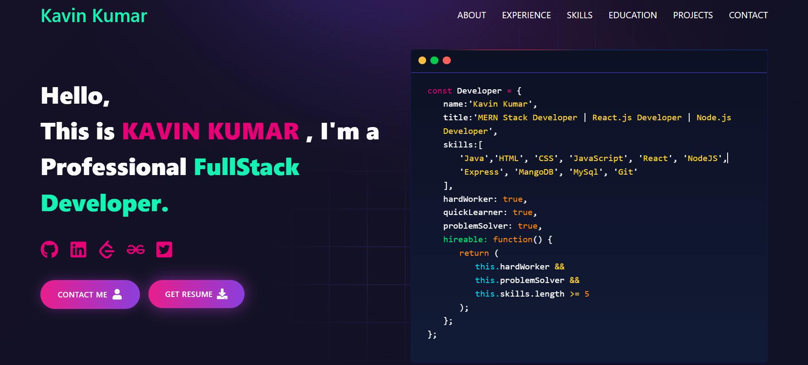

# 💼 Kavin Kumar – Developer Portfolio

Welcome to my personal **FullStack Developer Portfolio**, built using **React.js**.  
This website showcases my skills, experience, projects, education, and contact details in a modern and responsive UI.
---
🌐 **Live Demo:** https://kavin-devportfolio.vercel.app  

---
## 🚀 Features

- ⚛️ Developed using **React.js**
- 🎨 Modern UI with animations
- 📱 Fully responsive design
- 🧩 Component-based structure
- ✨ Lottie animation support
- 🔗 Social media integration
- 📄 Resume download option
- 💻 Code-styled introduction section

---

## 🛠️ Tech Stack

### **Frontend Technologies**
- React.js  
- CSS / Custom Styling  
- React-Bootstrap  
- Lottie-react  
- React Icons  

### **Tools Used**
- Git & GitHub  
- Vercel (Deployment)

---

## 📂 Folder Structure

```bash
📦 kavin-devportfolio
├── public/
│   ├── assets/             
│   ├── Screenshot/             
│   └── vite.svg
├── src/
│   ├── Animation/          
│   ├── Components/        
│   │   ├── Home/
│   │   ├── Skills/
│   │   ├── Education/
│   │   ├── Experience/
│   │   ├── Projects/
│   │   └── Contact/
│   ├── App.css              
│   ├── App.jsx             
│   ├── index.css           
│   ├── main.jsx
├── package.json
└── README.md
````

---

## 🔧 Installation & Setup

To run this project locally, follow the steps below:

```bash
# Clone this repository
git clone https://github.com/Kavinkumar84/Developer_Portfolio.git

# Navigate into the folder
cd Developer_Portfolio

# Install dependencies
npm install

# Start development server
npm run dev
```

➡️ Your app will now run at
**[http://localhost:5173](http://localhost:5173)**

---

## 🚀 Deployment (Vercel)

Deploy this portfolio with ease:

1. Push your code to GitHub
2. Open **[https://vercel.com](https://vercel.com)**
3. Import your GitHub repo
4. Click **Deploy**
5. Your site goes live in seconds 🚀

---

## 📸 Screenshots



---

## 📬 Contact

**Kavin Kumar**

🐙 GitHub: https://github.com/Kavinkumar84  
🔗 LinkedIn: https://www.linkedin.com/in/kavinkumar84/

## ⭐ Support

If you like this project, please consider giving it a **⭐ star** on GitHub.

---

